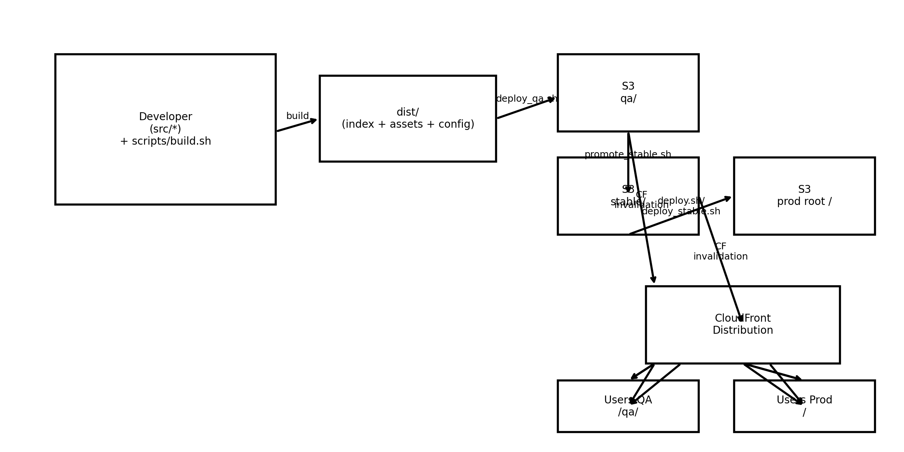

1️⃣ docs/Deployment/DEPLOYMENT_GUIDE.md

# Deployment Guide  
**Sense Energy Dashboard – Frontend**

---

## 📌 Objetivo

Este documento describe el flujo completo de **build, release y deployment** del frontend del Sense Energy Dashboard utilizando **AWS S3 + CloudFront**, asegurando despliegues reproducibles y seguros.

---

## 📂 Ubicación

docs/Deployment/DEPLOYMENT_GUIDE.md

---

## 🗺️ Pipeline de Deployment



---

## 🔁 Flujo General

src/
└─ build.sh
↓
dist/
└─ deploy_release.sh → s3:///releases/<BUILD_ID>/
↓
promote_stable.sh → s3:///stable/
↓
deploy.sh → s3:/// (PROD)
↓
CloudFront Invalidation

---

## 🛠️ Build

Genera artefactos versionados.

```bash
./scripts/build.sh
cat dist/BUILD_ID.txt

Salida esperada:
	•	dist/assets/js/app.<BUILD_ID>.js
	•	dist/assets/css/app.<BUILD_ID>.css
	•	dist/index.html
	•	dist/BUILD_ID.txt

⸻

📦 Release

Publica un build como release inmutable.

BUILD_ID="$(tr -d ' \n\r\t' < dist/BUILD_ID.txt)"
./scripts/deploy_release.sh "$BUILD_ID"

Destino:

s3://<bucket>/releases/<BUILD_ID>/


⸻

⭐ Promote a Stable

Marca un release como versión estable.

./scripts/promote_stable.sh "$BUILD_ID"

Destino:

s3://<bucket>/stable/


⸻

🚀 Deploy a Producción

Publica la versión estable en producción.

./scripts/deploy.sh

Este paso:
	•	Sincroniza todo desde stable/ al root del bucket
	•	Aplica headers correctos
	•	Invalida CloudFront (/index.html, /assets/*)

⸻

🔍 Validaciones Post-Deploy

Verificar S3

aws s3 ls s3://<bucket>/assets/js/ | tail
aws s3 ls s3://<bucket>/assets/css/ | tail
aws s3 ls s3://<bucket>/assets/chart/ | tail

Verificar CloudFront

curl -I https://<cloudfront>/index.html
curl -I https://<cloudfront>/assets/js/app.js
curl -I https://<cloudfront>/assets/css/app.css
curl -I https://<cloudfront>/assets/chart/chart.umd.min.4.4.1.js

Todos deben responder HTTP 200.

⸻

🧪 Troubleshooting rápido

Síntoma	Causa probable
403 en /assets/*	deploy.sh no sincronizó assets
UI rota	index.html apunta a assets inexistentes
Cambios no reflejados	Falta invalidación CloudFront


⸻

📅 Última actualización

Diciembre 2025

---

# 2️⃣ `SECURITY.md` (en la raíz del repo)

```markdown
# Security Policy  
**Sense Energy Dashboard – Frontend**

---

## 📌 Scope

Este documento define las prácticas de seguridad del repositorio.

Objetivos:
- Evitar exposición de secretos
- Separar configuración pública y privada
- Definir proceso de reporte de vulnerabilidades

---

## 🔐 Información Sensible (PROHIBIDO)

Nunca debe commitearse:
- AWS credentials
- Cognito client secrets
- API keys privadas
- SSH private keys (`id_rsa`, `id_ed25519`)
- Certificados TLS (`.pem`, `.pfx`, `.p12`)
- `.env` o configuraciones locales

Protección mediante:
- `.gitignore`
- Hook de pre-commit

---

## ✅ Configuración Permitida

Archivo permitido:

src/config.template.js

Características:
- Solo placeholders
- Sin valores reales
- Seguro para Git

Debe copiarse localmente como:

src/config.js

(ignorado por Git)

---

## 🛡 Pre-commit Security Controls

Este repositorio utiliza un hook de pre-commit que:
- Escanea cambios staged
- Detecta patrones de secretos
- Bloquea commits inseguros

Si un commit falla:

```bash
git diff --cached

Eliminar el valor detectado antes de continuar.

⸻

🚨 Reporte de Vulnerabilidades

Si detectas una vulnerabilidad:
	1.	NO abras issues públicos
	2.	Contacta directamente al owner del repositorio
	3.	Incluye:
	•	Descripción
	•	Pasos para reproducir
	•	Impacto potencial

⸻

🔄 Checklist de Seguridad

Antes de cada release:
	•	Hook de pre-commit limpio
	•	config.js no presente en Git
	•	.gitignore revisado
	•	Sin artefactos de build commiteados

⸻

📅 Última actualización

Diciembre 2025
